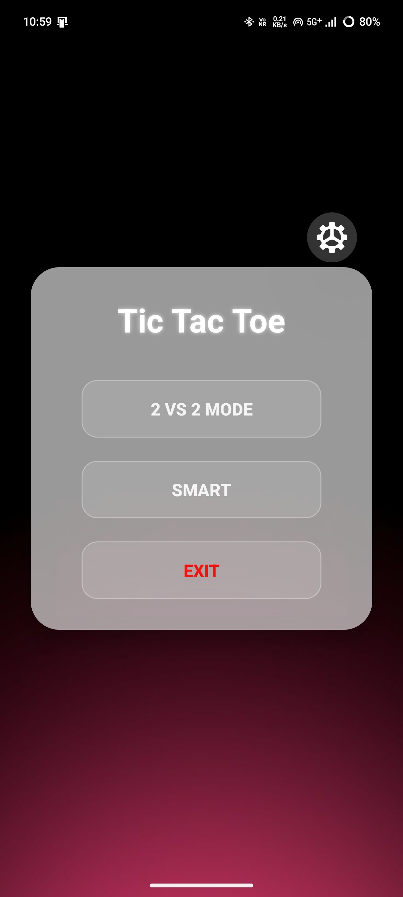
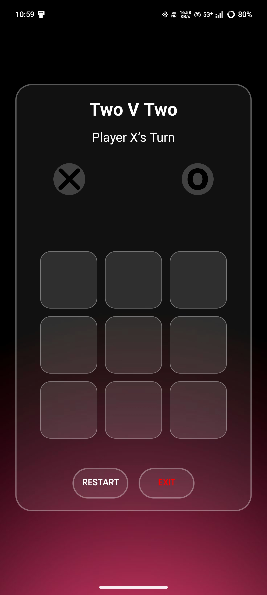
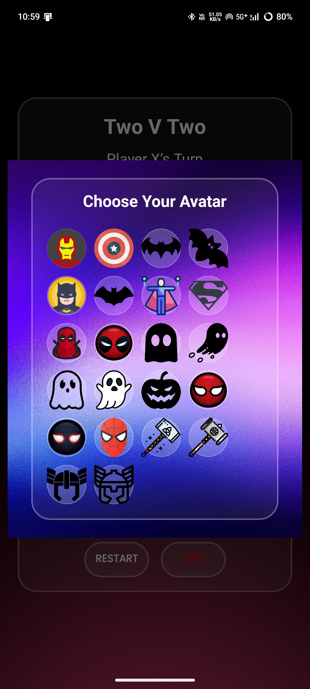
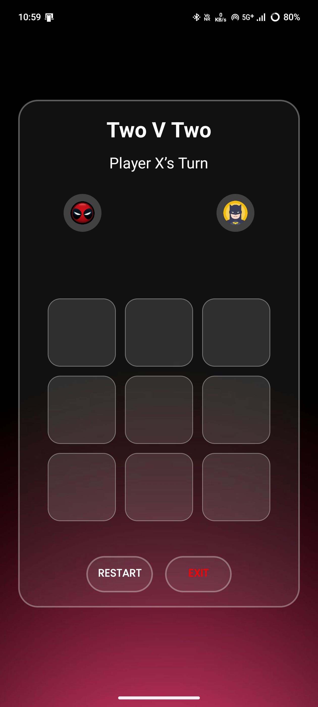
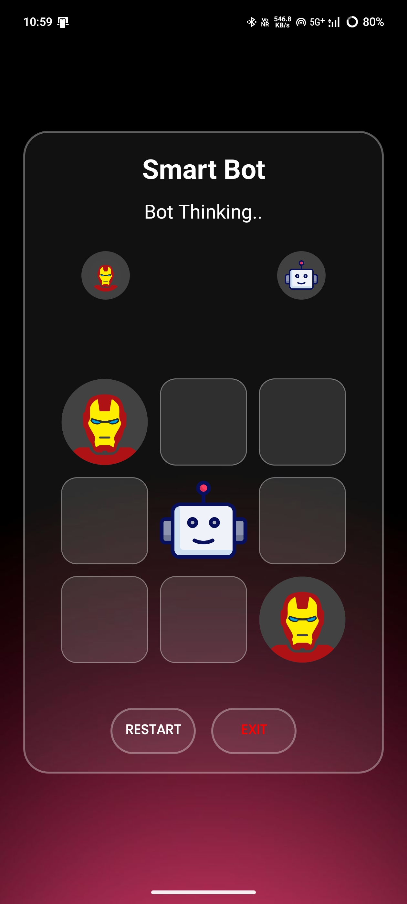
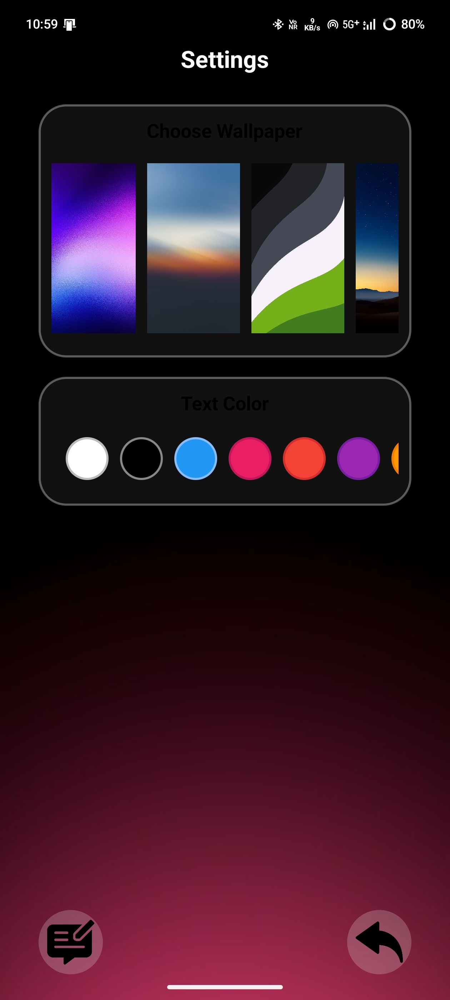

# 🎮 Tic Tac Toe Game  

<p align="center">
  
  
  
  
  
</p>

---

<p align="center">
  
</p>

---

## 🧩 Overview  

A **modern, clean, and premium Tic Tac Toe Game** built using **Kotlin** in **Android Studio**.  
It includes both **2v2** and **Bot** modes with **avatar customization**, **dynamic wallpapers**, and **smooth animations**.  
Designed for an engaging, intuitive, and enjoyable user experience.  

---

## 📸 Screenshots  

| 🏠 Main Page | 👥 2v2 Page | 🧑‍🤝‍🧑 2v2 Avatars |
|:-------------:|:-------------:|:-------------:|
|  |  |  |

| 🎯 2v2 Gameplay | 🤖 Bot Mode | ⚙️ Settings Page |
|:-------------:|:-------------:|:-------------:|
|  |  |  |

---

## ✨ Features  

- 🎮 **Two Game Modes** — 2v2 Multiplayer & Bot Mode  
- 🧑‍🎨 **Custom Avatars** — personalize your look  
- 🌈 **Dynamic Wallpapers & Text Themes**  
- 🏆 **Winner Highlight** with smooth transitions  
- 🔁 **Quick Reset & Replay**  
- ⚡ **Optimized Performance** for smooth gameplay  
- 💡 **Simple, Polished UI** perfect for all screen sizes  

---

## 🛠️ Tech Stack  

| Component | Technology |
|------------|-------------|
| **Language** | Kotlin |
| **IDE** | Android Studio |
| **Platform** | Android |
| **Version Control** | Git + GitHub |

---

## 🚀 How to Run  

1. Clone this repository  
   ```bash
   git clone https://github.com/Chandradeep5/Tic-Tac-Toe-Game.git


2.Open in Android Studio
3.Run on an emulator or physical device


💬 Developer Notes
This game was built with continuous learning, debugging, and improvements over time.
Every animation, reset logic, and customization feature was added step by step with care to ensure a smooth user experience.

🙏 Special Thanks
A heartfelt thank you to "ChatGPT" for assisting me throughout the development of this game 💡
From fixing crashes in 2v2 mode, handling avatar selections, improving gameplay logic, polishing the UI, to helping me prepare this README and GitHub publishing process — ChatGPT guided me like a true development companion 🤖💙


👨‍💻 Developer
Developed by: Chandradeep
🎯 Passionate about Android Development and building creative, interactive experiences.
